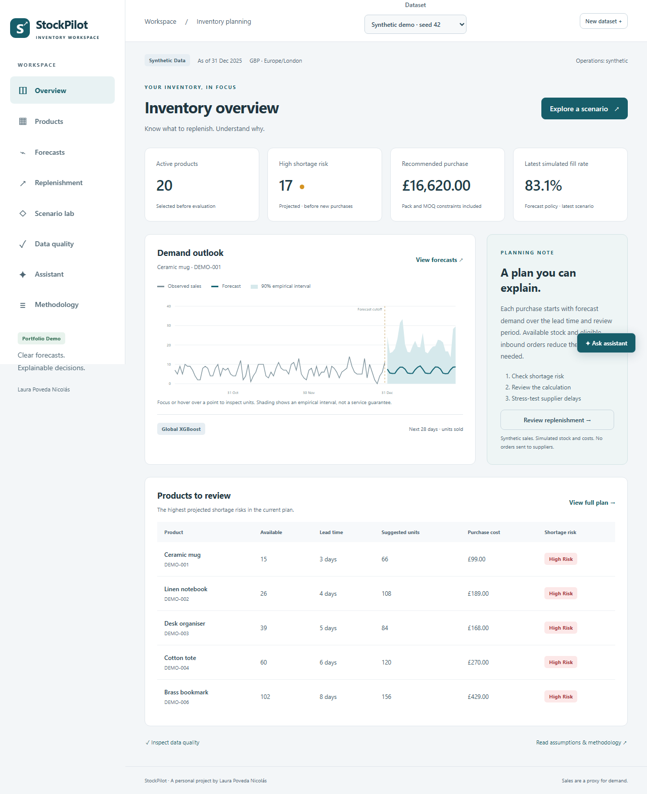

# StockPilot

Inventory planning project by **Laura Poveda Nicolás**.

StockPilot starts with a practical question: what should a small retailer order,
how much, and what happens if a supplier is late? It combines sales forecasts with
stock, incoming deliveries, pack sizes and a purchasing budget. Each recommendation
shows its calculation, and the scenario lab lets you compare the consequences.



## Run the demo

You need Docker Desktop or Docker Engine with Compose v2.

```sh
make demo
```

On Windows, without Make:

```powershell
./scripts/tasks.ps1 demo
```

Open [localhost:5173](http://localhost:5173). The API explorer is at
[localhost:8000/api/docs](http://localhost:8000/api/docs).

The command applies migrations, generates sales for 20 products, trains a forecast
and prepares a purchase plan. The demo uses seed 42 and 730 days ending on
31 December 2025. It needs no API key or external dataset download. Repeating the
command keeps existing data and reuses the prepared results.

## What you can do

- Import sales, stock and incoming orders from CSV, preview validation errors and
  keep your data separate from the demo.
- Compare observed sales with daily or weekly forecasts and inspect validation results.
- Review purchase quantities, pack rounding, minimum orders and budget allocation.
- Accept, reject or adjust a proposal, with a versioned decision history and CSV export.
- Simulate higher demand, delayed deliveries or a tighter budget across three policies.
- Ask the offline assistant about a product or purchasing policy and inspect its sources.

The interface adapts to desktop and mobile. [Mobile screenshot](docs/evidence/mobile-scenario.png).

## How it works

The backend uses Python, FastAPI, SQLAlchemy and PostgreSQL. React, TypeScript and
D3 provide the interface. Imports, training and simulations run through a persistent
PostgreSQL job queue with a separate worker.

```text
Sales → validation → daily series → forecast → purchase proposal → scenario
                              Inventory snapshots ↗
```

Forecasting compares seasonal naive and a 28-day moving average with global XGBoost.
Three expanding validation windows select the model; a separate final window measures
its performance. Recommendation quantities use simulated demand trajectories over
the supplier lead time plus the review period. The full calculation is saved with
its forecast and stock snapshot.

See [architecture](docs/architecture.md), [methodology](docs/methodology.md) and
[design notes](docs/design-notes.md) for the details and tradeoffs.

## Results

These are local evaluation results, not production outcomes. Both evaluations use
a 28-day final holdout.

| Dataset | Selected model | Validation WAPE | Test WAPE | Test MAE | 90% interval coverage |
|---|---|---:|---:|---:|---:|
| Synthetic, 20 products | XGBoost | 27.86% | 27.53% | 5.70 | 88.57% |
| UCI Online Retail II, 20 selected products | Moving average | 106.74% | 87.56% | 78.95 | 84.64% |

On the historical data, the moving average beat XGBoost in validation, but the final
error remained high. The historical result is a useful limit of this setup, rather
than evidence that a more complex model always improves the forecast.

The [synthetic manifest](docs/evidence/synthetic-forecast.json),
[historical manifest](docs/evidence/historical-forecast.json) and
[policy backtest](docs/evidence/historical-backtest.json) contain the measured results
and assumptions. The [case study](docs/portfolio-case-study.md) discusses them.

## Data

The default demo generates synthetic sales and fictional inventory, suppliers and
costs. The optional historical dataset is Chen, D. (2012), *Online Retail II*,
UCI Machine Learning Repository, [doi:10.24432/C5CG6D](https://doi.org/10.24432/C5CG6D),
licensed under CC BY 4.0. Customer identifiers are discarded.

```sh
make fetch-retail
make train-retail
docker compose exec api python -m stockpilot.cli backtest --dataset-id DATASET_UUID
```

The historical adapter processed 1,059,906 canonical rows. UCI provides sales,
not stock history or acquisition costs, so operational inputs remain simulated.
Recorded sales are a proxy for demand; the project cannot reconstruct unobserved
lost sales or demonstrate real business savings.

## Development and checks

Local development uses Python 3.12 with uv and Node 22 with npm. Dependencies are
pinned in both lockfiles. Start with [CONTRIBUTING.md](CONTRIBUTING.md) for setup,
database tests and formatting.

```sh
make setup
make test
make lint
make typecheck
make e2e
```

Local verification on 5 October 2026 passed 49 backend tests, 3 frontend tests and
6 desktop/mobile browser checks, plus lint, types and the production build.
The browser checks include axe accessibility scans and the full planning flow.
An [isolated source installation](docs/evidence/clean-install.md) also reproduced
the demo with fresh database and artifact volumes. GitHub Actions runs the checks
without downloading UCI or calling a paid model provider.

## Scope and next steps

This version supports one warehouse and one local user. Proposals do not send real
orders. Public demo mode restricts shared writes and isolates simulations, but public
hosting still needs its own network and security review.

The offline assistant covers a small set of questions. A backend-only LLM provider
is optional; external provider evaluation and embedding retrieval remain future work.
Other next steps are better treatment of volatile demand and artifact retention.

Code is licensed under [MIT](LICENSE). Dataset and dependency notices are in
[THIRD_PARTY_NOTICES.md](THIRD_PARTY_NOTICES.md).

[Documentation](docs/README.md) · [API](docs/api.md) · [Demo walkthrough](docs/demo-guide.md)
